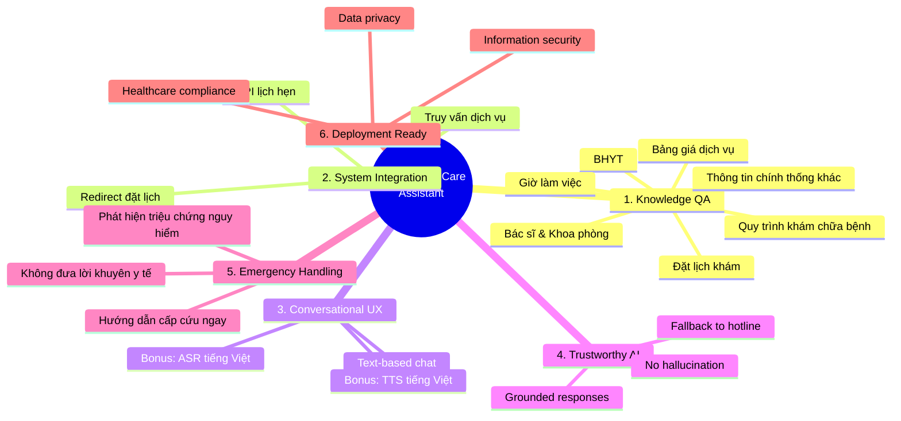
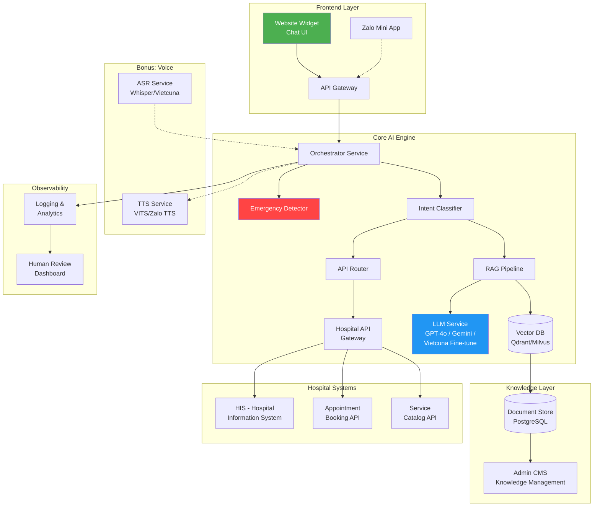
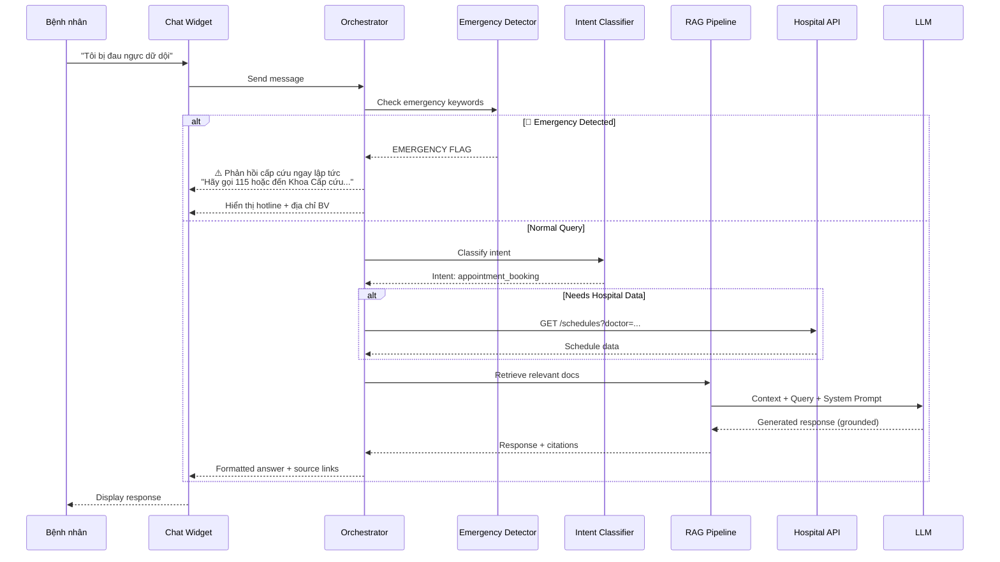
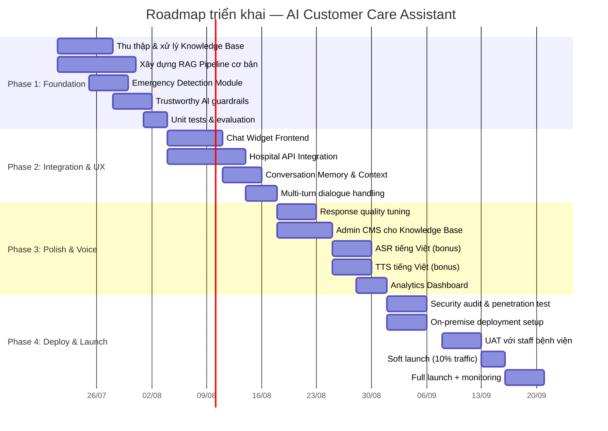
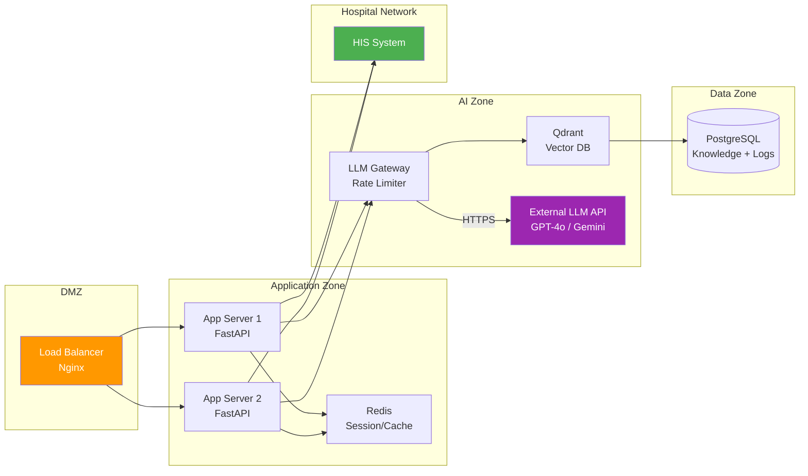
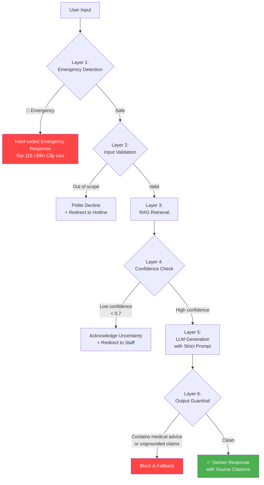

# 🏥 AI Customer Care Assistant — Bệnh viện Tim Hà Nội
## Phân tích đề bài & Roadmap triển khai

---

## 1. Phân tích đề bài

### 1.1. Bối cảnh & Bài toán cốt lõi

| Yếu tố | Chi tiết |
|---|---|
| **Đơn vị** | Bệnh viện Tim Hà Nội — BV chuyên khoa hạng I, tuyến cuối về tim mạch |
| **Quy mô** | 2,500–3,000 bệnh nhân ngoại trú/ngày |
| **Pain point** | Lượng câu hỏi lặp lại lớn → quá tải tổng đài/lễ tân → phản hồi chậm, trải nghiệm không đồng nhất |
| **Giải pháp** | AI Chatbot tích hợp trực tiếp vào website bệnh viện |

### 1.2. Phân rã 6 yêu cầu chức năng



### 1.3. Phân loại mức độ ưu tiên

| Mức | Yêu cầu | Lý do |
|---|---|---|
| 🔴 **Must-have** | Knowledge QA, Trustworthy AI, Emergency Handling | Lõi sản phẩm — sai = rủi ro pháp lý & y tế |
| 🟡 **Should-have** | System Integration, Deployment Ready | Tạo giá trị thực tế, đáp ứng yêu cầu vận hành |
| 🟢 **Nice-to-have** | ASR/TTS tiếng Việt | Bonus điểm, nâng trải nghiệm cho người cao tuổi |

### 1.4. Các thách thức kỹ thuật then chốt

> [!CAUTION]
> **Rủi ro y tế**: Chatbot KHÔNG được phép chẩn đoán hay tư vấn điều trị. Mọi response phải grounded 100% từ knowledge base chính thống. Sai lệch có thể gây hậu quả nghiêm trọng.

| # | Thách thức | Giải pháp hướng đến |
|---|---|---|
| 1 | **Tiếng Việt y khoa** — thuật ngữ chuyên ngành, viết tắt, lỗi chính tả | Fine-tune embedding model cho medical Vietnamese; synonym mapping |
| 2 | **Hallucination control** — LLM có thể bịa thông tin | RAG + citation + confidence threshold + fallback |
| 3 | **Emergency detection** — nhận diện triệu chứng nguy hiểm | Rule-based keyword layer + LLM classification dual-check |
| 4 | **Data freshness** — bảng giá, lịch bác sĩ thay đổi thường xuyên | Automated sync pipeline từ HIS/API bệnh viện |
| 5 | **Privacy & Compliance** — dữ liệu y tế nhạy cảm | On-premise deployment, PII masking, audit logging |

---

## 2. Kiến trúc hệ thống đề xuất

### 2.1. High-level Architecture



### 2.2. Luồng xử lý chính (Request Flow)



### 2.3. Tech Stack đề xuất

| Layer | Công nghệ | Lý do chọn |
|---|---|---|
| **Frontend** | React / Next.js + Widget SDK | Dễ embed vào website hiện tại, responsive |
| **Backend** | Python FastAPI | Ecosystem ML/AI mạnh, async native |
| **LLM** | GPT-4o (primary) hoặc Gemini 2.5 Pro | Hiểu tiếng Việt tốt, reasoning mạnh |
| **Embedding** | `multilingual-e5-large` hoặc fine-tune `bge-m3` | Hỗ trợ tiếng Việt, chất lượng retrieval cao |
| **Vector DB** | Qdrant (self-hosted) | Open-source, dễ on-premise, performance tốt |
| **Document Store** | PostgreSQL + pgvector | Backup vector search + metadata storage |
| **Cache** | Redis | Session management, rate limiting |
| **Orchestration** | LangChain / LlamaIndex | RAG pipeline, tool-calling, memory |
| **ASR (bonus)** | OpenAI Whisper large-v3 | SOTA tiếng Việt, free, self-host được |
| **TTS (bonus)** | Zalo AI TTS / VITS fine-tune | Giọng Việt tự nhiên |
| **Monitoring** | Langfuse / LangSmith | LLM observability, tracing, evaluation |
| **Deployment** | Docker + K8s (on-premise) | Bảo mật dữ liệu y tế, compliance |

---

## 3. Roadmap triển khai

### 3.1. Tổng quan 4 Phase — 12 tuần



### 3.2. Chi tiết từng Phase

---

#### 📦 Phase 1: Foundation (Tuần 1–3)
> *Mục tiêu: RAG pipeline hoạt động chính xác, phát hiện cấp cứu, không hallucinate*

| Task | Deliverable | Acceptance Criteria |
|---|---|---|
| **1.1 Thu thập Knowledge Base** | Bộ tài liệu chuẩn hóa (Markdown/JSON) | Cover ≥ 95% FAQ từ tổng đài |
| **1.2 Chunking & Embedding** | Vector DB với toàn bộ knowledge | Retrieval accuracy ≥ 90% trên test set |
| **1.3 RAG Pipeline** | API endpoint trả lời câu hỏi | Grounded answer rate ≥ 95% |
| **1.4 Emergency Detector** | Module phát hiện cấp cứu | Recall ≥ 99% (không miss emergency) |
| **1.5 Guardrails** | Hệ thống chặn hallucination | 0% fabricated medical advice |
| **1.6 Evaluation Framework** | Bộ test tự động + metrics | RAGAS score ≥ 0.85 |

**Chi tiết kỹ thuật Phase 1:**

```
📂 Knowledge Base Structure
├── 📄 appointment/
│   ├── booking_process.md
│   ├── online_booking_guide.md
│   └── follow_up_appointments.md
├── 📄 departments/
│   ├── cardiology.md
│   ├── cardiac_surgery.md
│   ├── pediatric_cardiology.md
│   └── ...
├── 📄 doctors/
│   └── doctor_profiles.json
├── 📄 insurance/
│   ├── bhyt_coverage.md
│   ├── required_documents.md
│   └── reimbursement_process.md
├── 📄 services/
│   ├── service_catalog.json
│   ├── pricing.json
│   └── working_hours.md
├── 📄 procedures/
│   ├── admission.md
│   ├── examination_flow.md
│   └── discharge.md
└── 📄 emergency/
    ├── emergency_symptoms.json
    └── emergency_procedures.md
```

**Emergency Detection — Dual-layer approach:**

```python
# Layer 1: Rule-based keyword detection (fast, high recall)
EMERGENCY_KEYWORDS = [
    "đau ngực dữ dội", "khó thở", "ngất xỉu", "bất tỉnh",
    "đau tim", "tức ngực", "tim đập nhanh bất thường",
    "mất ý thức", "co giật", "tím tái", "ngừng thở",
    "chest pain", "shortness of breath", "fainting"
]

# Layer 2: LLM classification (accurate, contextual)
EMERGENCY_SYSTEM_PROMPT = """
Bạn là bộ phân loại cấp cứu y tế. Đánh giá tin nhắn của bệnh nhân:
- EMERGENCY: Triệu chứng nguy hiểm cần cấp cứu ngay
- URGENT: Cần khám sớm nhưng chưa cấp cứu
- NORMAL: Câu hỏi thông tin thông thường
CHỈ trả về 1 từ: EMERGENCY, URGENT, hoặc NORMAL.
"""
```

---

#### 🔗 Phase 2: Integration & UX (Tuần 3–5)
> *Mục tiêu: Chat widget đẹp, tích hợp API bệnh viện, hội thoại đa lượt mượt mà*

| Task | Deliverable | Acceptance Criteria |
|---|---|---|
| **2.1 Chat Widget** | Floating widget embed vào website | Responsive, load < 2s, accessible |
| **2.2 Hospital API** | Connector tới HIS/Booking | Lấy được lịch hẹn, dịch vụ real-time |
| **2.3 Conversation Memory** | Multi-turn context management | Nhớ context trong phiên chat |
| **2.4 Intent Router** | Phân loại intent → route action | Accuracy ≥ 92% trên test intents |

**Intent Classification Schema:**

| Intent | Action | Example |
|---|---|---|
| `appointment.book` | Redirect → Booking page/Zalo | "Tôi muốn đặt lịch khám" |
| `appointment.check` | API call → Schedule lookup | "Bác sĩ A có lịch ngày nào?" |
| `insurance.coverage` | RAG → Knowledge Base | "BHYT chi trả những gì?" |
| `service.pricing` | RAG + API → Pricing data | "Siêu âm tim giá bao nhiêu?" |
| `doctor.info` | RAG → Doctor profiles | "Bác sĩ nào giỏi nhất về van tim?" |
| `procedure.guide` | RAG → Procedure docs | "Nhập viện cần giấy tờ gì?" |
| `emergency` | Hard-coded response | "Tôi đang đau ngực dữ dội" |
| `greeting` | Template response | "Xin chào" |
| `out_of_scope` | Polite decline + redirect | "Cho tôi hỏi về bệnh dạ dày" |

---

#### ✨ Phase 3: Polish & Voice (Tuần 5–8)
> *Mục tiêu: Nâng chất lượng response, thêm voice, dashboard quản trị*

| Task | Deliverable | Acceptance Criteria |
|---|---|---|
| **3.1 Response Tuning** | Prompt engineering + few-shot | User satisfaction ≥ 4.2/5 |
| **3.2 Admin CMS** | Web app quản lý Knowledge Base | CRUD documents, preview changes |
| **3.3 ASR (bonus)** | Speech-to-text tiếng Việt | WER < 15% trên medical terms |
| **3.4 TTS (bonus)** | Text-to-speech giọng Việt | MOS ≥ 3.8, latency < 3s |
| **3.5 Analytics** | Dashboard thống kê | Realtime metrics, conversation logs |

**Analytics Metrics:**

| Metric | Mô tả | Target |
|---|---|---|
| Response Accuracy | % câu trả lời chính xác (human eval) | ≥ 95% |
| Fallback Rate | % câu hỏi bot không trả lời được | ≤ 10% |
| Avg Response Time | Thời gian phản hồi trung bình | < 3s |
| Emergency Detection Rate | % emergency phát hiện đúng | ≥ 99% |
| User Satisfaction (CSAT) | Đánh giá từ bệnh nhân | ≥ 4.2/5 |
| Conversation Completion | % hội thoại giải quyết xong | ≥ 80% |
| Daily Active Conversations | Số phiên chat/ngày | Tracking |

---

#### 🚀 Phase 4: Deploy & Launch (Tuần 8–12)
> *Mục tiêu: Triển khai an toàn, tuân thủ bảo mật, vận hành ổn định*

| Task | Deliverable | Acceptance Criteria |
|---|---|---|
| **4.1 Security Audit** | Báo cáo bảo mật | Pass penetration test |
| **4.2 On-premise Deploy** | Hệ thống chạy trên infra BV | 99.5% uptime |
| **4.3 UAT** | User Acceptance Testing | Staff BV approve |
| **4.4 Soft Launch** | 10% traffic thử nghiệm | No critical bugs |
| **4.5 Full Launch** | 100% traffic + monitoring | Stable 48h |

**Deployment Architecture (On-premise):**



---

## 4. Chiến lược Trustworthy AI

> [!IMPORTANT]
> Đây là yếu tố QUAN TRỌNG NHẤT của dự án. Chatbot y tế sai thông tin có thể gây hậu quả nghiêm trọng.

### 4.1. Multi-layer Safety Architecture



### 4.2. System Prompt Strategy

```text
Bạn là trợ lý chăm sóc khách hàng của Bệnh viện Tim Hà Nội.

QUY TẮC BẮT BUỘC:
1. CHỈ trả lời dựa trên thông tin trong [CONTEXT] được cung cấp.
2. KHÔNG BAO GIỜ tự bịa thông tin về giá dịch vụ, lịch bác sĩ, hay quy trình.
3. KHÔNG đưa lời khuyên y tế, chẩn đoán bệnh, hay gợi ý thuốc.
4. Nếu không có đủ thông tin, nói rõ: "Xin lỗi, tôi chưa có thông tin này.
   Quý khách vui lòng liên hệ Tổng đài 1900-xxxx để được hỗ trợ."
5. Luôn ghi nguồn thông tin cuối câu trả lời.
6. Phản hồi lịch sự, chuyên nghiệp, dễ hiểu.
7. Nếu phát hiện triệu chứng nguy hiểm → NGAY LẬP TỨC hướng dẫn cấp cứu.
```

---

## 5. Compliance & Data Privacy

| Yêu cầu | Giải pháp |
|---|---|
| **PII Protection** | Không lưu trữ CMND/CCCD, SĐT trong conversation logs; masking tự động |
| **Data Residency** | On-premise deployment, dữ liệu không rời khỏi infra BV |
| **Audit Trail** | Log toàn bộ conversation (anonymized) cho review |
| **Access Control** | RBAC cho Admin CMS, API key rotation |
| **Encryption** | TLS 1.3 in-transit, AES-256 at-rest |
| **Nghị định 13/2023/NĐ-CP** | Tuân thủ quy định bảo vệ dữ liệu cá nhân Việt Nam |
| **Thông tư 46/2018/TT-BYT** | Tuân thủ quy định về CNTT trong y tế |

---

## 6. Đội ngũ đề xuất

| Vai trò | Số lượng | Trách nhiệm |
|---|---|---|
| **Tech Lead / AI Engineer** | 1 | Kiến trúc hệ thống, RAG pipeline, LLM integration |
| **Backend Developer** | 1–2 | API, Hospital integration, deployment |
| **Frontend Developer** | 1 | Chat widget, Admin CMS |
| **Domain Expert (BV)** | 1 | Cung cấp & validate knowledge base |
| **QA / Tester** | 1 | Test scenarios, evaluation, UAT |

---

## 7. Rủi ro & Mitigation

| # | Rủi ro | Mức độ | Mitigation |
|---|---|---|---|
| 1 | LLM hallucinate thông tin y tế | 🔴 Cao | Multi-layer guardrails + human review |
| 2 | API bệnh viện không sẵn sàng / thiếu tài liệu | 🟡 TB | Mock API → graceful degradation |
| 3 | Knowledge base không đầy đủ | 🟡 TB | Iterative update + admin CMS |
| 4 | Latency cao khi gọi LLM API | 🟡 TB | Caching, streaming response, fallback model |
| 5 | Bệnh nhân lớn tuổi không quen chatbot | 🟢 Thấp | UI đơn giản + voice option (bonus) |
| 6 | Chi phí LLM API cao với 3000 user/ngày | 🟡 TB | Smart caching, smaller model cho FAQ đơn giản |

---

## 8. Ước tính chi phí vận hành (hàng tháng)

| Hạng mục | Ước tính | Ghi chú |
|---|---|---|
| **LLM API** (GPT-4o) | $500–1,500/tháng | ~3000 conversations/ngày, avg 5 turns |
| **Infrastructure** (on-premise) | Tận dụng infra BV | GPU server nếu self-host LLM |
| **Vector DB + PostgreSQL** | $0 (open-source) | Self-hosted Qdrant |
| **Monitoring** (Langfuse) | $0–200/tháng | Open-source hoặc cloud |
| **Maintenance** | 1 engineer part-time | Knowledge update, model tuning |

> [!TIP]
> **Tối ưu chi phí**: Có thể dùng model nhỏ hơn (GPT-4o-mini, Gemini Flash) cho các câu hỏi FAQ đơn giản, chỉ dùng model lớn cho câu hỏi phức tạp → giảm ~60% chi phí LLM.

---

## 9. KPIs đo lường thành công

| KPI | Target Phase 1 | Target 3 tháng | Target 6 tháng |
|---|---|---|---|
| **Response Accuracy** | ≥ 90% | ≥ 95% | ≥ 97% |
| **Emergency Detection Recall** | ≥ 99% | ≥ 99.5% | ≥ 99.9% |
| **Hallucination Rate** | ≤ 5% | ≤ 2% | ≤ 1% |
| **Avg Response Time** | < 5s | < 3s | < 2s |
| **User Satisfaction (CSAT)** | ≥ 3.8/5 | ≥ 4.2/5 | ≥ 4.5/5 |
| **Hotline Call Reduction** | 10% | 25% | 40% |
| **Self-service Resolution Rate** | ≥ 60% | ≥ 75% | ≥ 85% |

---

## 10. Tổng kết

Dự án AI Customer Care Assistant cho Bệnh viện Tim Hà Nội là bài toán **RAG-based conversational AI** trong domain **healthcare** — đòi hỏi sự cân bằng giữa **trải nghiệm người dùng** và **an toàn y tế tuyệt đối**.

**3 trụ cột thành công:**

1. **🎯 Accuracy** — Knowledge base đầy đủ + RAG pipeline chất lượng
2. **🛡️ Safety** — Multi-layer guardrails + emergency detection + no hallucination
3. **💬 Experience** — UI thân thiện + phản hồi nhanh + voice support

> [!NOTE]
> Roadmap 12 tuần trên đây là baseline. Tùy vào mức độ sẵn sàng của API bệnh viện và chất lượng knowledge base ban đầu, timeline có thể điều chỉnh ± 2 tuần.
